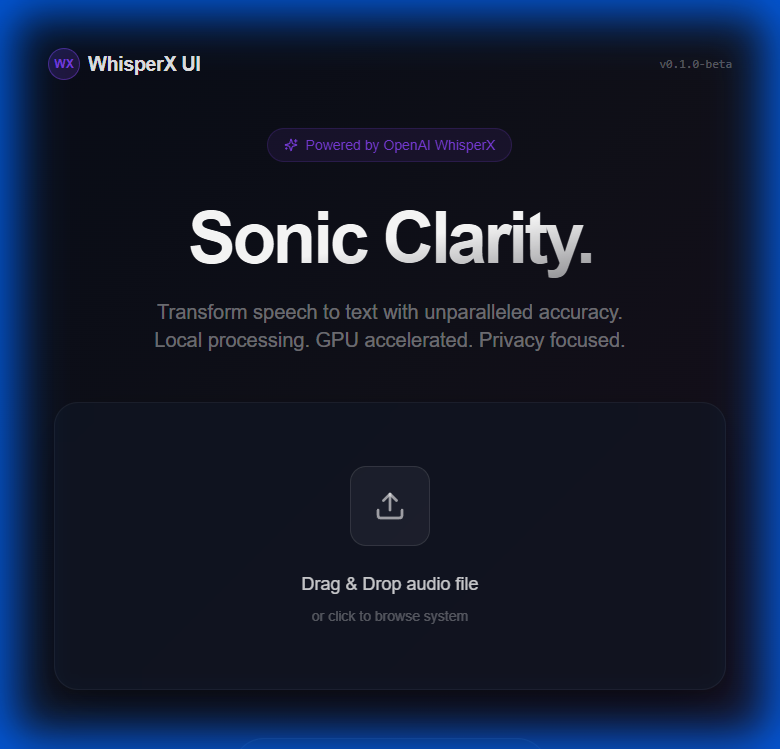
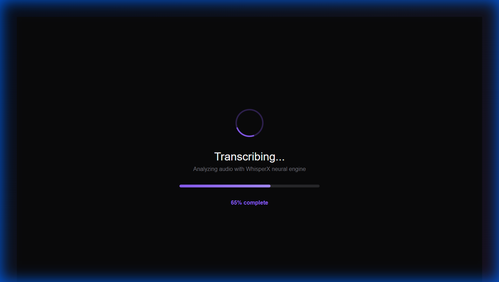
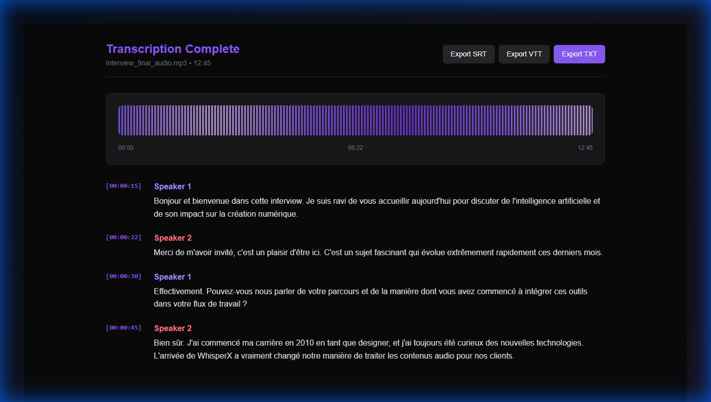

# WhisperXUI

Interface moderne pour **WhisperX** - transcription audio locale.

## 1. Interface d'Accueil

## 2. Fichier Sélectionné

## 3. Transcription en Cours

## 4. Résultat Final

## Fonctionnalités
- **Traitement Local** : Privacy-first, données jamais uploadées
- **GPU Accelerated** : Via WhisperX
- **Diarisation** : Identification automatique des locuteurs
- **Export Multiple** : SRT, VTT, TXT
