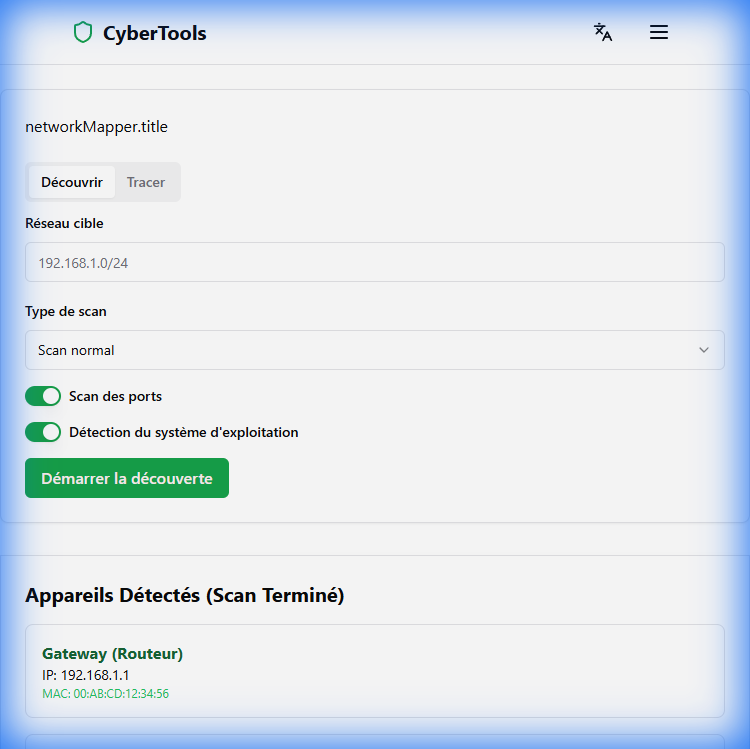
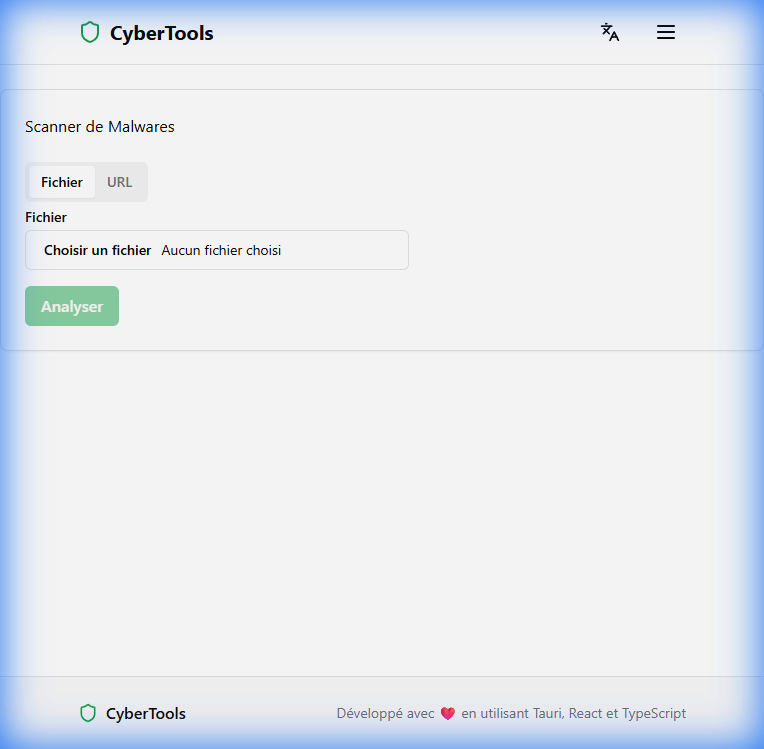

# CyberTools

**CyberTools** est une suite de sécurité offensive et défensive moderne, développée avec **Tauri** (Rust) et **React**.

## Tableau de Bord

## Cartographie Réseau
Découverte des appareils sur le réseau local.

## Analyseur de Trafic
Visualisation en temps réel des flux réseaux.

## En-têtes de Sécurité
Analyse des en-têtes HTTP de sécurité.

## Scanner de Malware
Analyse de fichiers suspects.

## Analyseur de Mots de Passe
Évaluation de la robustesse des mots de passe.

## Outil de Chiffrement
Interface de chiffrement AES.

