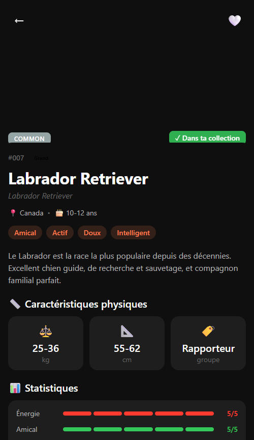

# DogoDex

## 📱 Présentation

DogoDex est une application mobile de type "Pokédex pour chiens" permettant aux utilisateurs de découvrir, identifier et cataloguer les races de chiens rencontrées dans la vie réelle.

## 🎨 Design

- **Style**: Dark mode premium avec accents corail (#FF7F50)
- **Thème**: Warm & playful, inspiré des apps de collection
- **Gamification**: Système de niveau, XP, streak et raretés

## 📸 Screenshots

### Écran d'accueil
L'écran d'accueil présente les statistiques de l'utilisateur, ses rencontres récentes et les races les plus populaires.

### DogoDex (Liste des races)
Le Pokédex complet avec filtres par taille et options de tri.

### Fiche détaillée d'une race
Toutes les informations sur une race : tempérament, caractéristiques physiques, statistiques et faits amusants.

### Collection personnelle
Les chiens rencontrés par l'utilisateur avec dates, lieux et notes.

## 🚀 Fonctionnalités

- **Catalogue de 18+ races** avec photos et informations détaillées
- **Système de collection** pour enregistrer les rencontres
- **Gamification** : niveaux, XP, streak, raretés
- **Recherche et filtres** par nom, taille
- **Favoris** pour marquer les races préférées
- **Fun facts** pour chaque race

## 💻 Technologies

- React Native + Expo
- expo-router pour la navigation
- TypeScript
- Design system personnalisé
