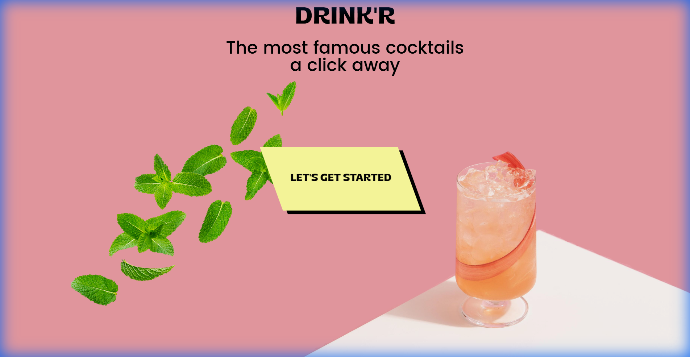
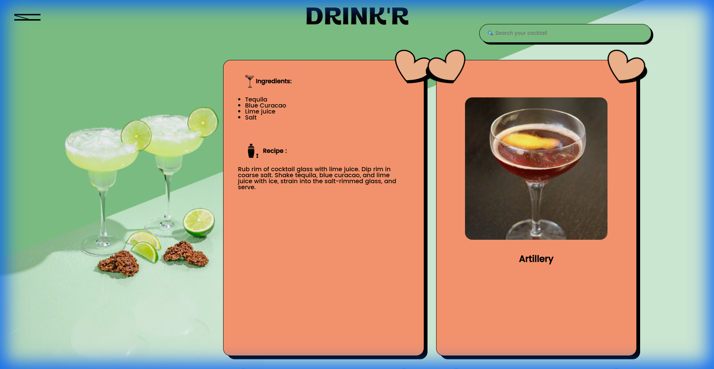
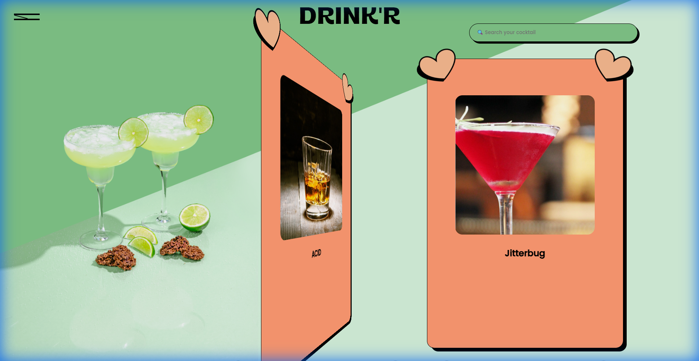
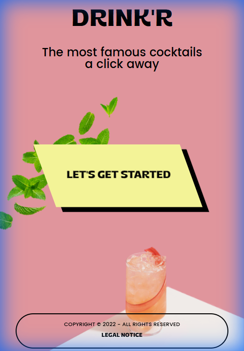
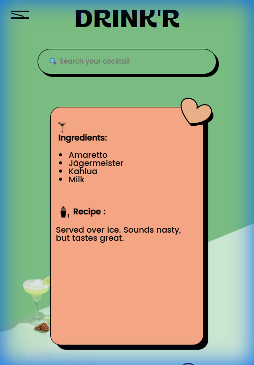
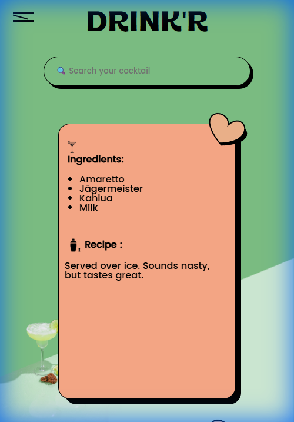

# DRINKR

## Description
DRINKR est une application web interactive dédiée à l'univers des cocktails. Développée initialement comme projet de groupe à la Wild Code School, elle permet aux utilisateurs de rechercher et découvrir une vaste collection de recettes de cocktails.

L'interface met l'accent sur une expérience utilisateur fluide et visuelle, utilisant des cartes interactives ("flip cards") qui révèlent les ingrédients et les instructions de préparation au clic. Conçue avec React, l'application s'adapte parfaitement aux écrans desktop et mobile.

**Fonctionnalités clés :**
- Recherche de cocktails par nom ou ingrédient.
- Affichage dynamique des recettes sous forme de cartes.
- Interface responsive (Desktop / Mobile).

## Captures d'écran

### Desktop

### Mobile

