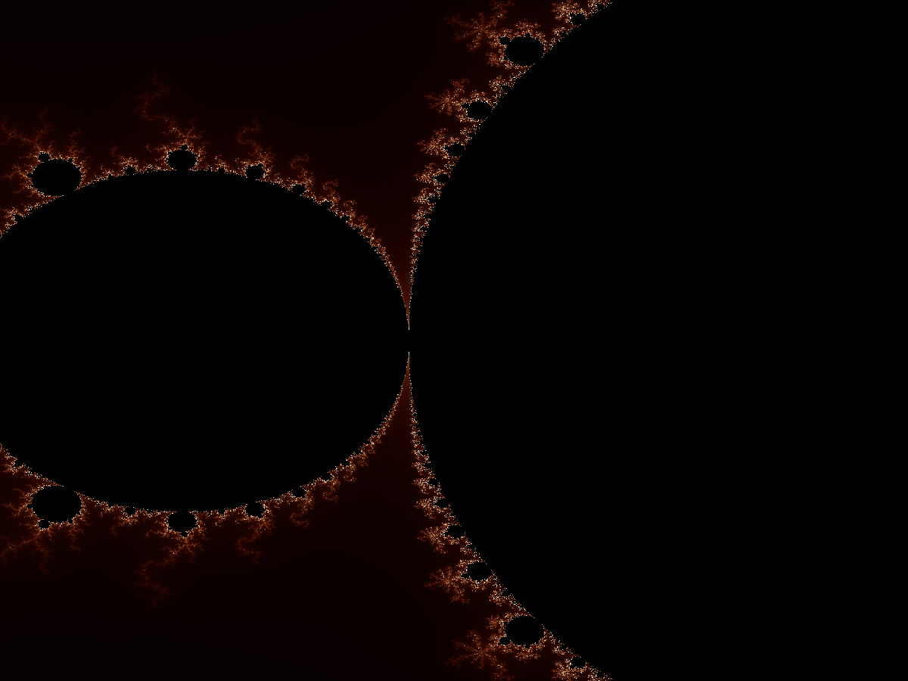

# Fractal Generator

**Fractal Generator** est une application native haute performance développée en **Rust**, permettant l'exploration interactive de structures mathématiques complexes.

Conçu avec l'interface **egui** et optimisé pour le calcul parallèle via **Rayon**, ce générateur offre une fluidité exceptionnelle même à haute résolution.

## Fonctionnalités Clés
- **5 Types de Fractales** : Mandelbrot, Julia, Burning Ship, Tricorn, Newton.
- **5 Palettes de Couleurs** : Feu, Océan, Arc-en-ciel, Classique, Niveaux de gris.
- **Performance** : Calcul multithreadé (CPU) et système de cache intelligent.
- **Export** : Sauvegarde haute qualité (PNG).

## Galerie

### Ensemble de Mandelbrot (Palette Feu)

### Ensemble de Julia (Palette Océan)

### Burning Ship (Palette Arc-en-ciel)

### Ensemble de Newton (Palette Classique)

### Interface Utilisateur
Voici un aperçu de l'interface de l'application avec les réglages :

