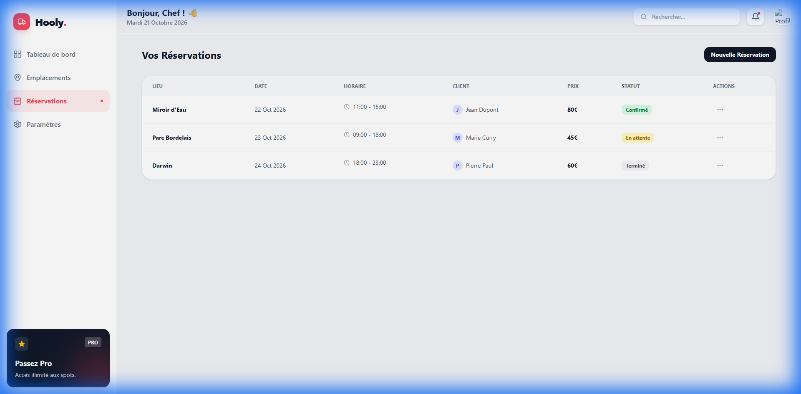
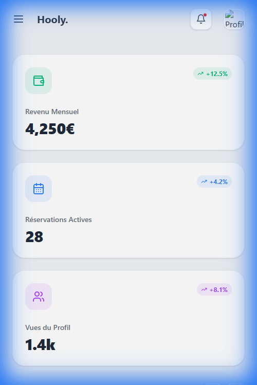
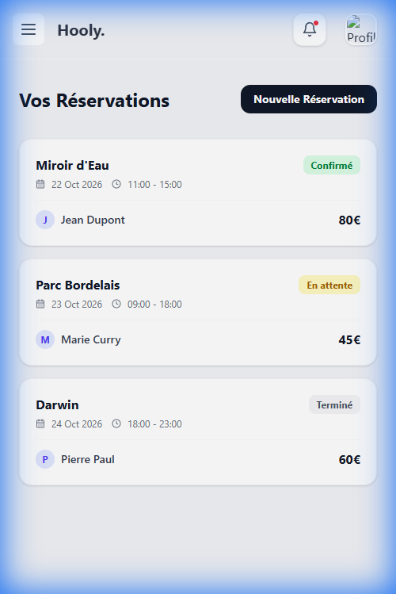

# Hooly

**Hooly** est une plateforme dédiée aux professionnels de la restauration mobile (Food Trucks). Elle simplifie la gestion des emplacements, des réservations et du suivi de l'activité commerciale.

L'objectif du projet était de créer une interface "Premium" et intuitive permettant aux gérants de :
- Visualiser leurs statistiques de revenus et d'activité.
- Trouver et réserver des emplacements stratégiques en ville.
- Gérer leur planning de manière efficace.

## Stack Technique
- **Frontend** : React.js, Tailwind CSS (v4).
- **Design** : Glassmorphism, Clean UI, Animations fluides (Framer Motion).

## Galerie

### Desktop Interface
#### Tableau de Bord

#### Emplacements

#### Réservations

### Mobile Interface

  
  

