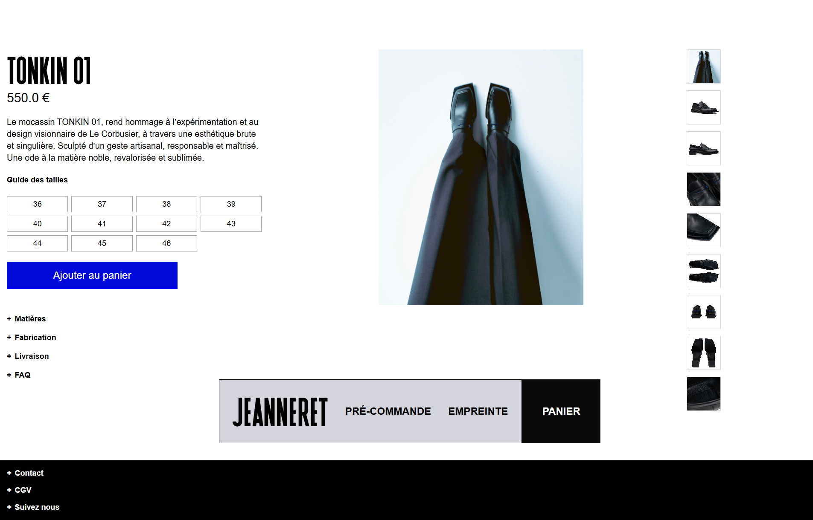
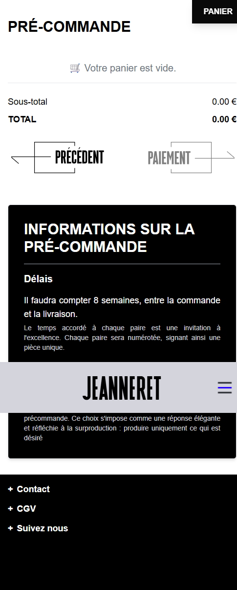

# Jeanneret Paris

**Jeanneret Paris** est une marque de chaussures de luxe éco-responsables Made in France. Le site e-commerce présente les collections, l'histoire de la marque et permet l'achat en ligne.

## Stack Technique
- **Plateforme** : Shopify (Hydrogen / Oxygen)
- **Frontend** : React, Tailwind CSS
- **Design** : Minimaliste, Luxe, Typographie soignée.

## Captures d'écran

### Desktop
| Home | Collection |
|:---:|:---:|
|  |  |

| Produit (Tonkin 01) | A Propos (Empreinte) |
|:---:|:---:|
|  |  |

| Panier |
|:---:|
|  |

### Mobile
| Home | Collection |
|:---:|:---:|
|  |  |

| Produit (Tonkin 01) | A Propos (Empreinte) |
|:---:|:---:|
|  |  |

| Panier |
|:---:|
|  |

## Fonctionnalités Clés
- Catalogue produits filtrable
- Fiches produits détaillées avec guides des tailles
- Panier et Checkout Shopify
- Pages de contenu (Histoire, Valeurs)
