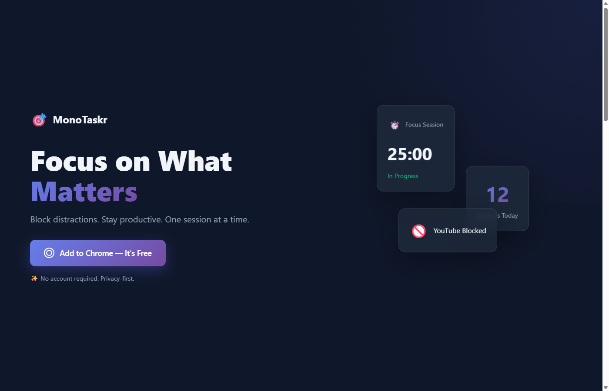
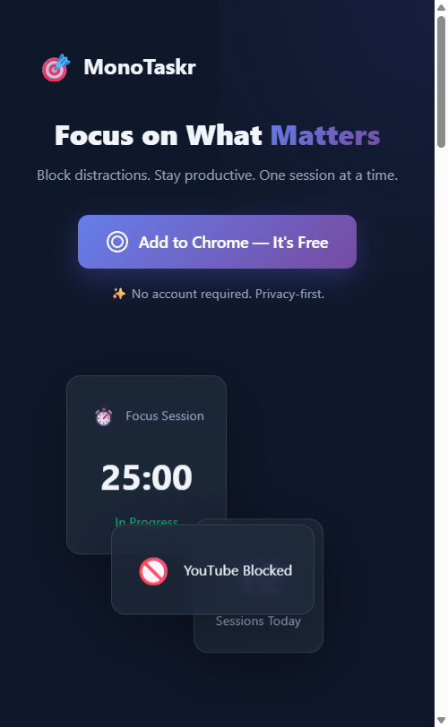

# MonoTaskr

## 📱 Présentation

MonoTaskr est une extension Chrome de productivité qui bloque les sites distrayants pendant les sessions de focus. Basée sur la technique Pomodoro avec gamification intégrée.

## 🎨 Design

- **Style**: Clean, minimal, dark/light themes
- **Couleurs**: Tons violet/bleu avec accents
- **Interface**: Popup compact et landing page moderne

## 📸 Screenshots

### Extension Popup
Screenshots officiels de l'extension Chrome Web Store.

### Landing Page

## 🚀 Fonctionnalités

- **⏱️ Timer Pomodoro** : Sessions de 25, 45 ou 60 minutes
- **🚫 Blocage intelligent** : YouTube, Facebook, Twitter, Reddit...
- **📊 Statistiques** : Sessions du jour, temps total de focus
- **🎮 Gamification** : Niveaux, XP, badges à débloquer
- **🎨 Thèmes** : Light, Dark, System
- **📅 Programmation** : Blocage automatique selon horaires
- **🔓 Accès temporaire** : 1 minute d'accès sur pages bloquées
- **☕ Mode pause** : Déblocage temporaire sans arrêter la session

## 💎 Points clés

- 100% local - Aucun compte requis
- Privacy-first - Données sur l'appareil uniquement
- Open Source (MIT License)
- Manifest V3

## 💻 Technologies

- React + TypeScript
- Vite pour le build
- TailwindCSS
- Chrome Extensions API (Manifest V3)
- Local Storage

## 🔗 Liens

- Chrome Web Store: [À venir]
- [Landing Page](landing/index.html)
