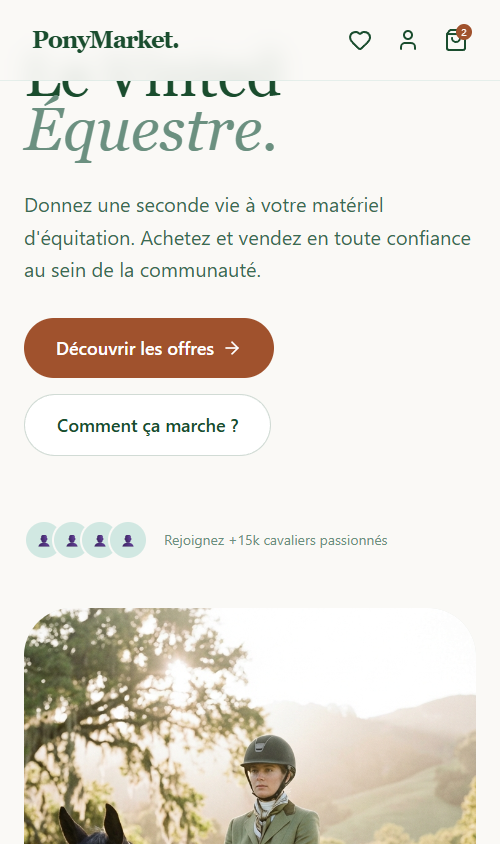
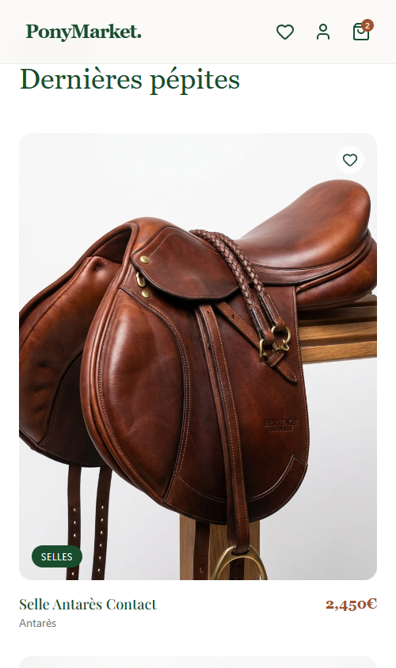
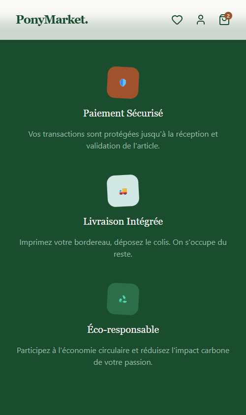
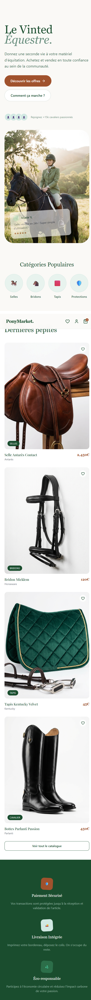

# Pony Market

**Pony Market** est une marketplace C2C premium dédiée à l'équipement équestre ("Le Vinted de l'équitation").

## Stack Technique
- **Framework** : Next.js 14 (App Router)
- **Styling** : Tailwind CSS, Framer Motion
- **Design System** : Palette Vert Amande / Crème, Typographie Serif (Playfair Display) pour un rendu luxe/authentique.
- **Assets** : Photos produits générées par IA (Style Studio Pro)

## Captures d'écran

### Desktop Visuals
| Hero Section | Categories |
|:---:|:---:|
|  |  |

| Listings (Generated Products) | Trust & Reassurance |
|:---:|:---:|
|  |  |

### Full Views
| **Desktop Full** | **Mobile Full** |
|:---:|:---:|
|  |  |

## Assets Générés (Exemples)
| Selle | Bridon |
|:---:|:---:|
|  |  |
