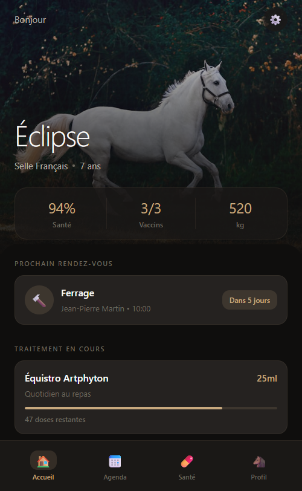
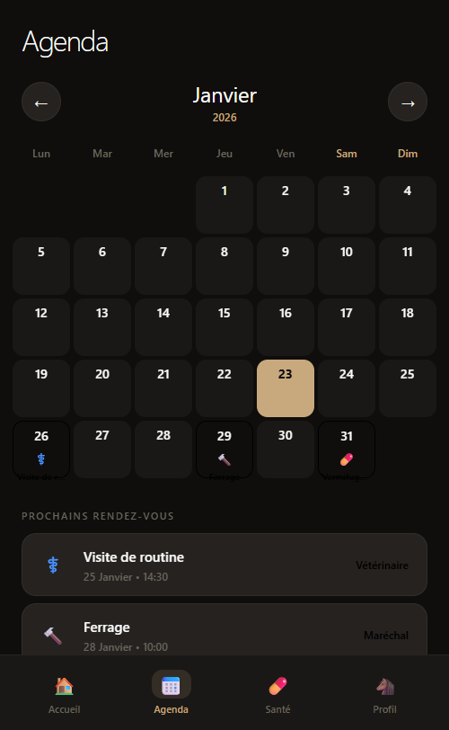
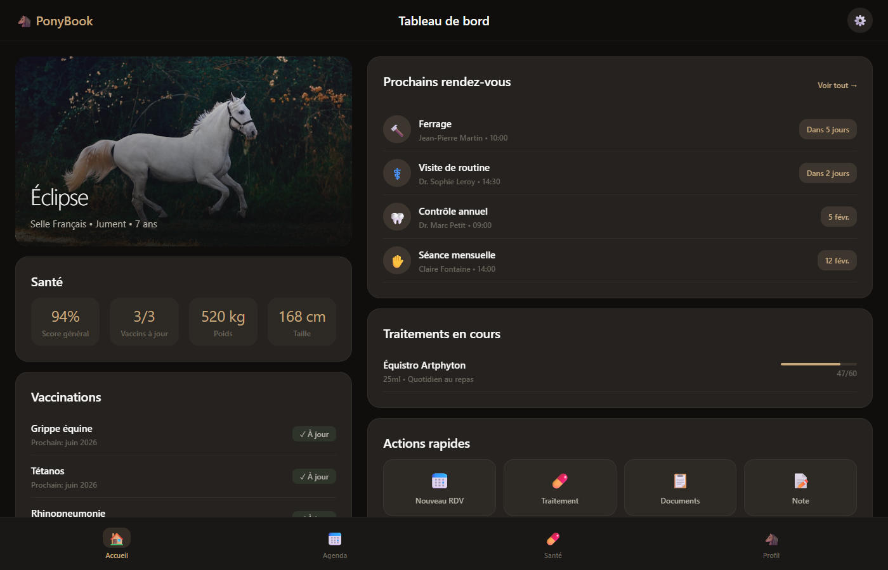

# PonyBook - Carnet de Santé Équin

## Description

**PonyBook** est une application mobile de carnet de santé numérique pour chevaux. Elle permet aux propriétaires et cavaliers de centraliser toutes les informations de santé de leurs équidés au même endroit.

### Fonctionnalités principales

- 🐴 **Gestion multi-chevaux** - Fiches détaillées pour chaque cheval avec photo, race, identification SIRE
- 💉 **Suivi des vaccinations** - Historique complet et rappels automatiques
- 📅 **Calendrier des rendez-vous** - Vétérinaire, maréchal-ferrant, ostéopathe, dentiste
- 💊 **Gestion des traitements** - Suivi des médicaments en cours avec doses restantes
- 🔔 **Alertes intelligentes** - Notifications pour vaccins expirés et rendez-vous proches
- 📋 **Documents numériques** - Stockage des documents officiels (carte SIRE, attestations)

### Technologies

- **React Native / Expo** - Framework mobile cross-platform
- **expo-linear-gradient** - Dégradés premium
- **expo-blur** - Effets glassmorphism
- **react-native-svg** - Graphiques circulaires animés
- **TypeScript** - Typage statique

### Design

Interface premium inspirée des meilleures apps de santé avec :
- Palette nature/équestre (verts profonds, tons terre, accents dorés)
- Effets glassmorphism et dégradés subtils
- Cards avec images de fond et overlays
- Micro-animations et transitions fluides
- Score de santé visuel avec cercles de progression

## Screenshots

### Mobile

| Dashboard | Profil Cheval | Calendrier | Médicaments |
|-----------|---------------|------------|-------------|
|  |  |  |  |

### Desktop

## Données de démonstration

L'app inclut des données fictives réalistes :
- **3 chevaux** : Éclipse du Vallon (Selle Français), Sultan des Étoiles (Pur-Sang Arabe), Tonnerre de Brest (Trotteur Français)
- **Rendez-vous** : Ferrage, vaccinations, contrôles dentaires, ostéopathie
- **Traitements** : Gastrogard (prévention ulcères), Artphyton (support articulaire)
- **Alertes** : Vaccin expiré, rappels de médicaments

## Statut du projet

Ce projet était une idée de carnet de santé équin connecté aux API officielles (SIRE France) mais n'a jamais été finalisé. L'interface présentée ici est une version améliorée avec données fictives pour démonstration portfolio.

---

*Projet personnel - 2024*
