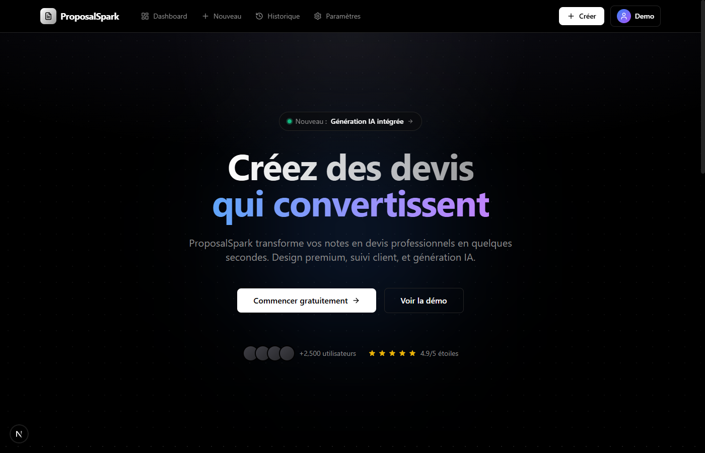
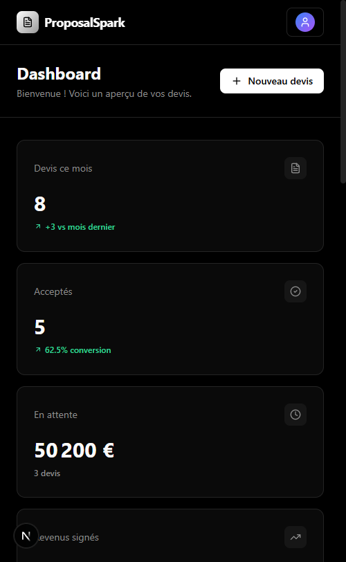

# ProposalSpark

## 📱 Présentation

ProposalSpark est un SaaS de gestion de devis professionnels, permettant de créer, envoyer et suivre des propositions commerciales avec l'aide de l'IA.

## 🎨 Design

- **Style**: Vercel-inspired, dark mode ultra-clean
- **Thème**: Grille de points, gradients subtils, glassmorphism
- **UI**: Minimaliste, professionnel, premium

## 📸 Screenshots

### Landing Page
Page d'accueil avec hero animé, features cards et social proof.

### Dashboard
Tableau de bord avec statistiques, liste de devis et feed d'activité.

### Mobile
Interface responsive optimisée mobile.

## 🚀 Fonctionnalités

- **Dashboard** : Vue d'ensemble avec KPIs (devis envoyés, taux de conversion, revenus)
- **Liste de devis** : Statuts colorés (brouillon, envoyé, consulté, accepté, refusé)
- **Feed d'activité** : Suivi temps réel des actions clients
- **Données fictives** : 6 devis, 5 clients, activités récentes

## 💎 Design System

- **Couleurs** : Noir pur (#000), blanc (#fff), accents bleu/violet
- **Composants** : stat-card, status-badge, btn-primary/secondary/ghost
- **Effets** : bg-grid-pattern, bg-gradient-radial, blur-backdrop

## 💻 Technologies

- Next.js 15 (App Router + Turbopack)
- React 19
- TypeScript 5
- TailwindCSS 3.4
- Prisma ORM
- PostgreSQL
- Lucide Icons
