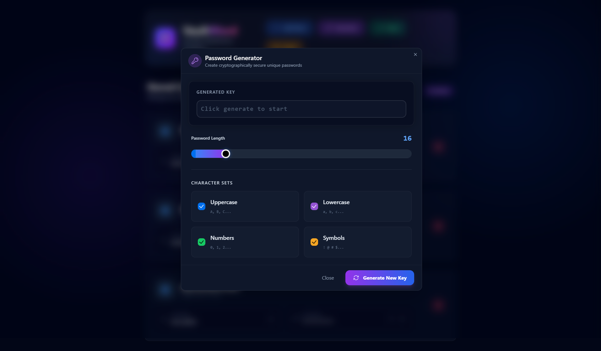
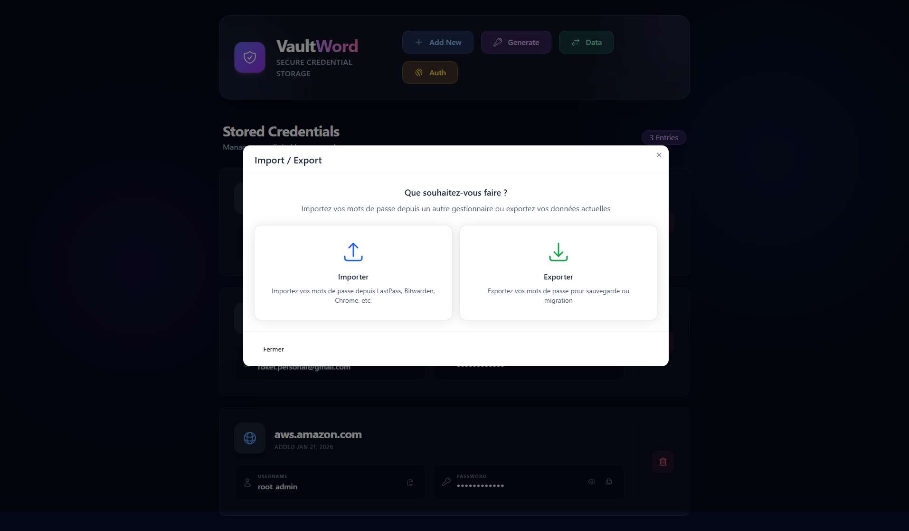

# VaultWord - Refonte Graphique Dark Glass

Transformation complète de l'interface utilisateur de VaultWord avec un thème "Dark Glass" moderne et premium.

## Screenshots Desktop (1920x1080)

### Liste des mots de passe

### Modal d'ajout

### Générateur de mots de passe

### Import / Export

---

## Changements Majeurs

- **Global Theme**: Palette sombre (Slate-900), accents néon (Blue/Purple), et effets de flou (Glassmorphism).
- **Header**: Refonte avec effets de lueur et typographie moderne.
- **Liste**: Cartes interactives avec animations Framer Motion, effets de survol, et typographie claire.
- **Modals**: Style unifié avec backdrop blur, inputs sombres contrastés, et iconographie cohérente.
- **Empty States**: Illustrations plus riches et engageantes.

## Fichiers Modifiés

- [Header.tsx](file:///c:/Users/roket/Documents/dev/imageproject/VaultWord/src/components/Header.tsx)
- [PasswordList.tsx](file:///c:/Users/roket/Documents/dev/imageproject/VaultWord/src/components/PasswordList.tsx)
- [AddPasswordModal.tsx](file:///c:/Users/roket/Documents/dev/imageproject/VaultWord/src/components/AddPasswordModal.tsx)
- [PasswordGeneratorModal.tsx](file:///c:/Users/roket/Documents/dev/imageproject/VaultWord/src/components/PasswordGeneratorModal.tsx)
- [index.css](file:///c:/Users/roket/Documents/dev/imageproject/VaultWord/src/index.css)
- [App.tsx](file:///c:/Users/roket/Documents/dev/imageproject/VaultWord/src/App.tsx)
