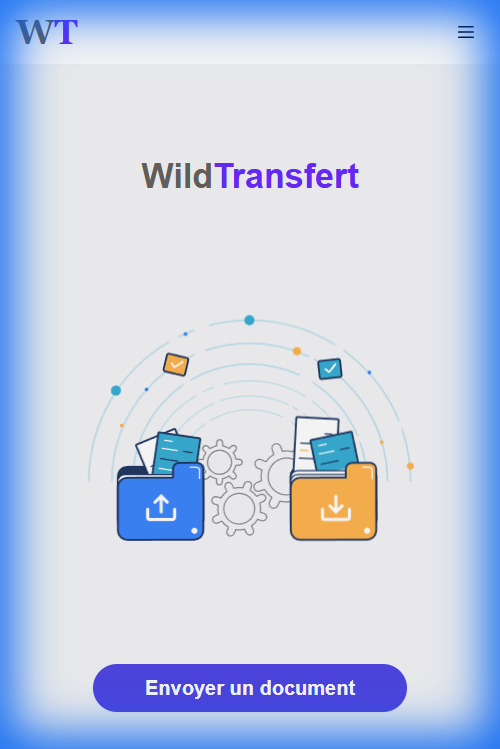
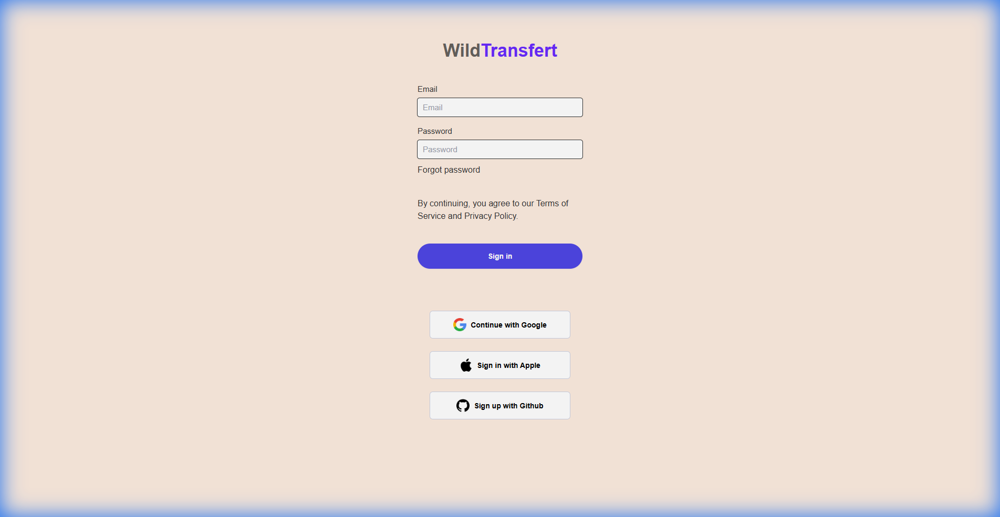
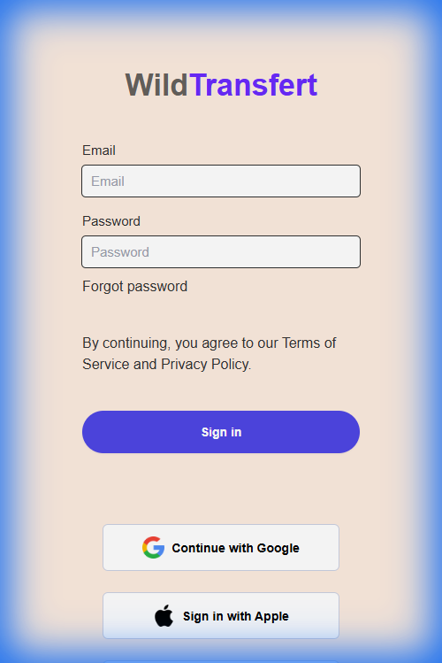
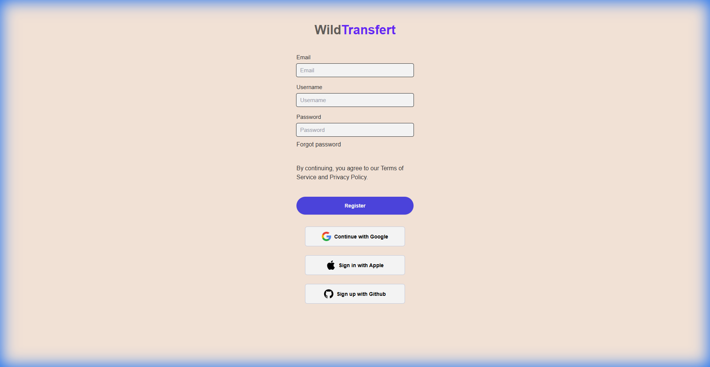
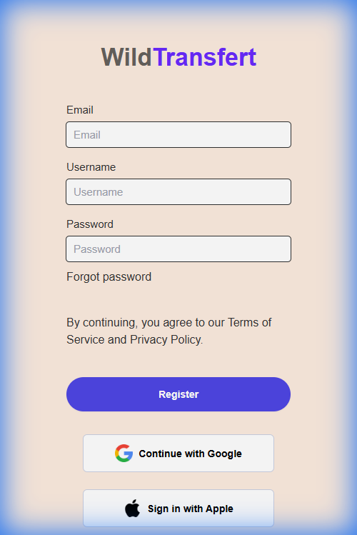
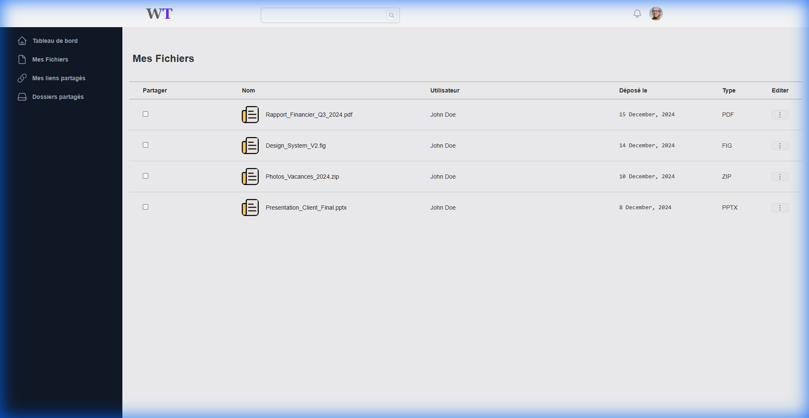
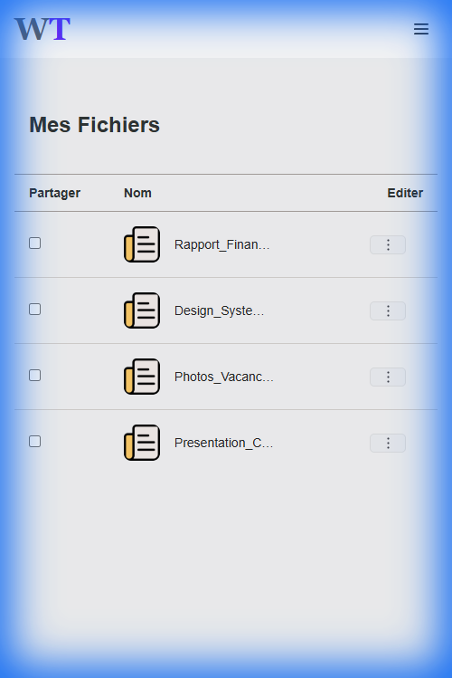

# Wild-Transfer - Clone WeTransfer

Clone fonctionnel de WeTransfer permettant l'envoi de fichiers volumineux.

## 🛠 Tech Stack

- **Frontend** : React, Vite, TailwindCSS
- **Mobile** : React Native, Expo
- **Backend** : Node.js, Express, Apollo Server (GraphQL), TypeORM
- **Database** : PostgreSQL (Docker)

---

## 📱 Aperçu Complet

### 🏠 Home - Dashboard Connecté
Page principale avec navigation et CTA.

---

### 🔐 Authentification

#### Login

#### Register

---

### 📂 Gestion des Fichiers
Interface table avec liste des fichiers uploadés.

---

### 👤 Profil Utilisateur
Paramètres du compte avec avatar, email, mot de passe.

---

## ✨ Fonctionnalités

- **Upload Drag & Drop**
- **SSO** : Google, Apple, GitHub
- **Gestion des Fichiers** : Liste, partage, suppression
- **Profil** : Avatar, changement mot de passe
- **Responsive** : Desktop & Mobile
