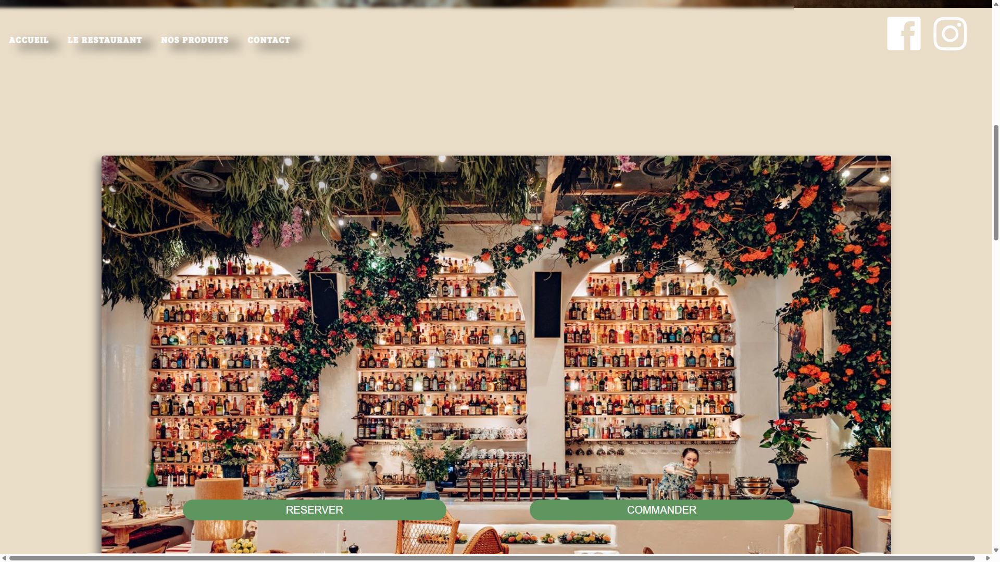
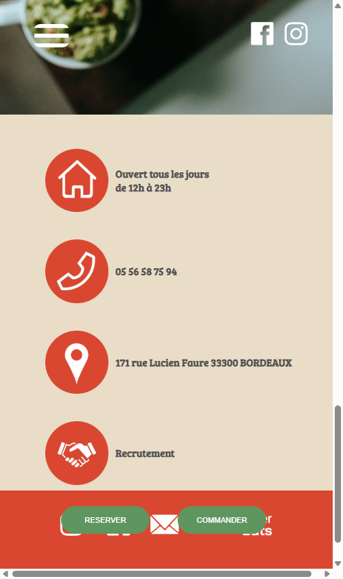

# Wilda-Trattoria

**Wilda Trattoria** est un site vitrine ("Single Page Application") pour un restaurant italien à Bordeaux. Il présente le restaurant, son ambiance, ses produits et les informations de contact.

## Stack Technique
- **Frontend** : HTML5, CSS3, JavaScript (Vanilla), jQuery.
- **Design** : Responsive Design (Mobile First approach), Animations CSS.

## Captures d'écran

### Desktop
| Header | Le Restaurant |
|:---:|:---:|
|  |  |

| Nos Produits | Contact |
|:---:|:---:|
|  |  |

### Mobile
| Header | Le Restaurant |
|:---:|:---:|
|  |  |

| Nos Produits | Contact |
|:---:|:---:|
|  |  |

## Fonctionnalités
- Navigation fluide (Scrollspy / Anchor links)
- Animations de chargement et de contenu
- Liens vers les réseaux sociaux et plateformes de livraison
