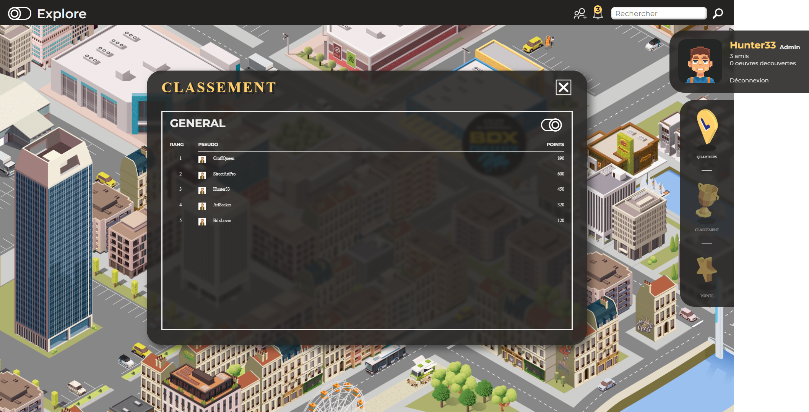
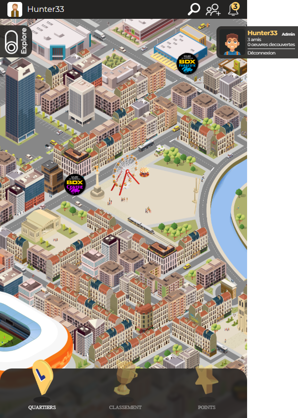
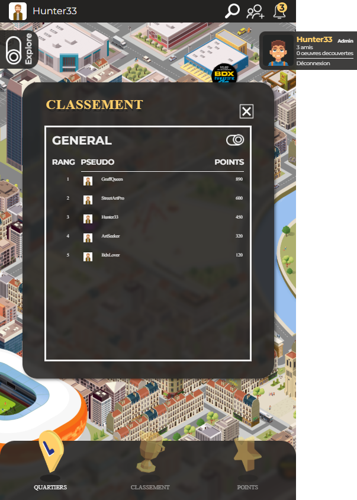

# WIN-DA-STREET - Street Art Hunt Application

## Description
WIN-DA-STREET est une application interactive de chasse au street art à Bordeaux. Elle permet aux utilisateurs de découvrir, scanner et collectionner des oeuvres urbaines disséminées dans les différents quartiers de la ville (Maritime, Centre, Sud, La Bastide).

L'application gamifie la découverte artistique avec un système de points, un classement des meilleurs chasseurs, et des profils utilisateurs détaillés.

## Fonctionnalités Clés
- **Carte Interactive** : Visualisation des quartiers et des zones de chasse.
- **Exploration par Quartier** : Liste des oeuvres disponibles par zone géographique.
- **Scanning & Collection** : Validation des découvertes (simulé).
- **Leaderboard** : Classement des utilisateurs selon leur score.
- **Profil Joueur** : Suivi de la progression et avatar.

## Captures d'écran

### Desktop
| Home / Map | Quartiers |
|:---:|:---:|
|  |  |

| Liste d'Oeuvres | Détail / Interaction |
|:---:|:---:|
|  |  |

| Leaderboard |
|:---:|
|  |

---

### Mobile
| Home | Quartiers |
|:---:|:---:|
|  |  |

| Liste d'Oeuvres | Leaderboard |
|:---:|:---:|
|  |  |

| Login / Profil |
|:---:|
|  |
